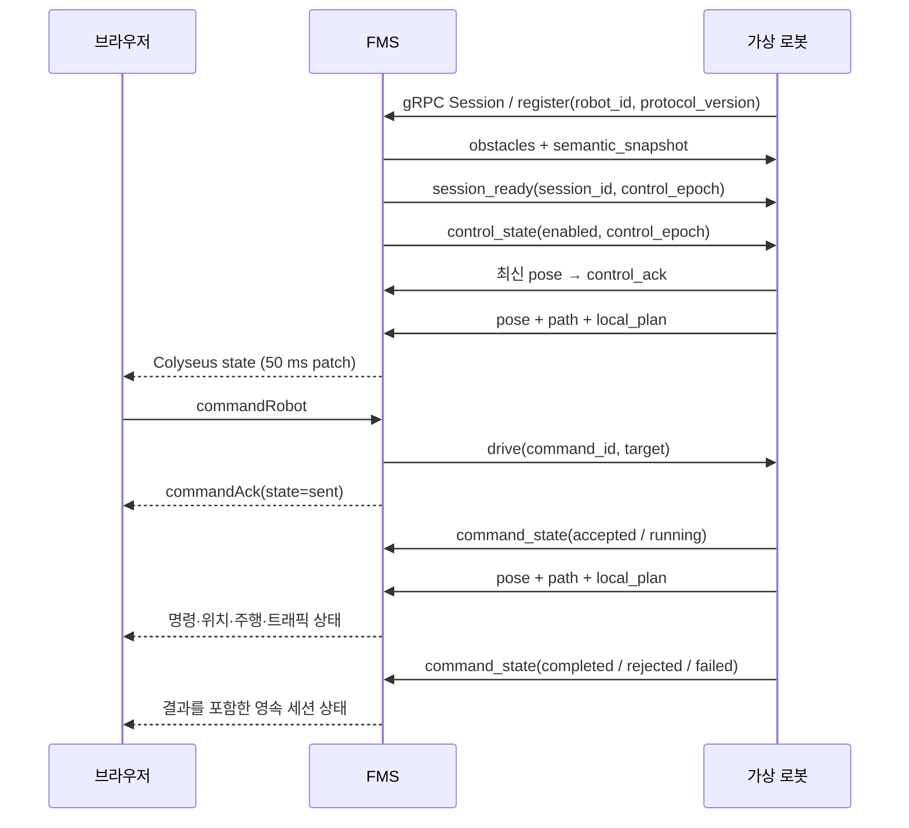

# 가상 로봇 ↔ FMS ↔ 브라우저 상태 연동

> 후속 설계: [로봇 상태·점유 복구·주행 방식](design/robot-runtime-state.md).
> 상태 모델·영속 점유·운영 복구 구현의 결정 근거와 향후 확장 경계는 위 설계 문서에서 관리한다.

2026-09-15. 메시지 정본은 `proto/robot.proto`, 버전·시간 제한·명령 상태는
`shared/robotProtocol.ts`다. MQTT는 사용하지 않는다.



## 통신과 등록

| 연결 | 주소 | 방식 |
|---|---|---|
| 로봇 → FMS | localhost:50062 | `bgfms.RobotBridge.Session`, gRPC 양방향 스트림 |
| 브라우저 → FMS | localhost:2568 | Colyseus `floor` 룸 |
| 브라우저 UI | localhost:5174 | 웹 클라이언트 |

프로토콜 버전은 2이다. v1 클라이언트는 연결을 거부하므로 FMS와 가상 로봇을 함께 업데이트한다. 등록 시 로봇 ID와 버전을 검사하고, 이후 메시지는 해당
스트림에 등록된 ID에만 적용한다. FMS가 룸과 리소스를 준비한 뒤 gRPC를 연다.
로봇은 맵 스냅샷과 `session_ready`를 받고 `control_state`를 적용한다. 새 세션·제어 세대에서는 기존 작업과 허가를 정리하고, 최신 pose를 먼저 보낸 뒤 `control_ack`를 보낸다. FMS의 제어 준비 확인 이후에만 정상 명령을 허용한다.

FMS는 500 ms마다 `heartbeat`를 보낸다. 가상 로봇은 3초 동안 heartbeat가 없으면
주행을 보류하고 스트림을 종료해 재연결한다. FMS도 로봇 메시지가 3초간 없으면
연결 끊김을 투영한다. 로봇은 등록 직후 전체 pose·path·local_plan을 보내고,
이후 pose와 local_plan은 50 ms 주기, path는 변경 시 보낸다.

## 명령 생명주기

| 상태 | 의미 |
|---|---|
| idle | 아직 명령 없음 |
| sent | FMS에서 전송함. 로봇 수락·주행 성공은 아직 확인 전 |
| accepted | 로봇이 명령을 받음 |
| running | 실행 중. 트래픽 대기 중에도 명령은 유지됨 |
| completed | 실제 목적지와 최종 각도에 도착 |
| cancelled | 로봇에서 취소 처리 완료 |
| rejected | 명령을 실행할 수 없어 거절 |
| failed | 실행 도중 실패 |
| interrupted | 연결 또는 제어 권한이 끊겨 실제 결과 확인 중. 새 세션에서 과거 작업 자동 재개 안 함 |

`commandAck`는 **전송 확인**이다. 실제 결과는 gRPC `command_state` 또는 주기 pose의
`command_id`, `command_state`, `command_reason`을 받아 Colyseus에 저장한다.
취소는 새 ID를 만들지 않고 실행 중인 `command_id`를 지정한다. 취소 전송만으로
완료를 표시하지 않는다. 완료된 명령 ID/결과는 로봇의 다음 pose에도 유지된다.

FMS는 다른 과거 명령 ID의 결과와 같은 명령의 역행 상태를 무시한다. 정상 명령·경로·단기 계획·트래픽 메시지는 세션 ID와 제어 세대가 일치해야 적용한다. 운영 제외 중에도 위치·실제 작업/주행 보고는 수신하지만 과거 경로와 허가는 복원하지 않는다.
따라서 새 브라우저가 들어와도 이벤트 이력 없이 현재 명령 결과를 볼 수 있다.
이 상태는 FMS 메모리의 세션 투영이며 별도의 영구 명령 이력 DB는 아니다.

## 브라우저가 받는 상태

`Robot`에 위치·각도, `status`, `connected`, `motion`, `trafficStatus`, 전체 `path`와
함께 다음을 투영한다.

- `commandId`, `commandState`, `commandReason`: 명령과 실제 실행 결과
- `lastSeenAt`: 서버가 마지막 상태를 수신한 시각
- `localPath`, `localHorizonS`: 단기 주행 계획과 예측 시간
- `leaseId`, `headRoomPx`: 트래픽 권한과 전방 여유

브라우저는 `room.onStateChange`로 패치 완료마다 로봇 카드·선택 상태·지도 경로를
갱신한다. WebSocket 연결이 끊기면 명령 버튼을 잠그고 재연결한다. 이전 룸의 늦은
콜백이 새 연결을 끊지 않도록 룸 인스턴스도 확인한다.


## 독립된 상태와 운영 복구

공통 용어는 [`shared/robotRuntime.ts`](../shared/robotRuntime.ts)에 정의한다.

| 축 | 필드 | 값 |
| --- | --- | --- |
| 작업 | `workState` | idle / busy / unknown |
| FMS 운영 참여 | `fmsControlState` | enabled / disabled |
| 통신 | `connectionState` | online / offline |
| 실제 주행 | `driveState` | stationary / moving / waiting / paused / blocked / unknown |
| 원인 목록 | `driveContextJson` | 원인 코드, source, 리소스 참조, 차단 로봇, requestId, permissionState, since 배열 |
| 현재 주행 방식 | `navigationMode`, `pathPlanningAuthority` | 가상 로봇은 free_navigation / robot |

미종료 명령이 있으면 점유 대기 중에도 busy이다. moving은 실제 좌표·각도 변화로
판단하며 허가만으로 이동 중으로 표시하지 않는다. 통신 두절 시 작업·주행의 현재
투영은 unknown이고 마지막 위치와 보고 시각은 남는다. disabled와 online, moving은
동시에 존재할 수 있다. 운영 제외는 물리 정지 확인과 동일하지 않다.

우측 **로봇 탭 → RUNTIME**에서 로봇의 원인·대상·차단 로봇·대기 시간을 확인하고
운영 제외/재개를 수행한다. 구역 리소스 목록은 실제 점유, 진입 예약, 대기열을 구분한다.
각 점유의 해제 버튼은 확인창을 거친다. 지도 아이콘은 운영 제외/통신 두절을
링·기호로 구분하고 작업/주행 상태를 함께 표시한다.

### 저장과 수동 해제

`data/runtime.sqlite`는 편집 데이터 `data/editor.sqlite`와 분리한다.

- `robot_runtime`: 운영 설정·제어 세대·마지막 보고 및 위치. 위치 보고 저장은 최대 1초 주기로 묶고 제어 전이는 즉시 저장한다.
- `runtime_occupancies`: map/resource 참조, 로봇, occupied/reserved/queued, FIFO 순서, 요청 ID·세대·시각.
- `runtime_audit`: 운영 제외·재활성화·수동 해제의 요청과 결과. 현재 사용자 인증 기능이 없으므로 처리자는 실제 Colyseus 클라이언트 세션 ID로 기록한다.

수동 해제는 **선택한 점유 해제 + 로봇 disabled + controlEpoch 증가 + 감사 기록**을
동일 SQLite 트랜잭션에서 처리한다. 나머지 점유는 유지한다. 제외 로봇의 뒤늦은
보고로 해제한 점유를 다시 만들지 않는다. 정상 구역 정원 제어는 DB 복원 후 시작한다.
오프라인/동기화 전 보유자는 보수적으로 유지한다. 오프라인 대기열도 보존하되
실제로 연결·동기화된 대기자만 순서대로 허가한다.

점유 테이블은 상태 전이에만 쓴다. 트래픽 tick마다 동일 데이터를 다시 쓰지 않는다.
구역 삭제 시 해당 구역의 활성 점유도 정리한다. 기존 기본 트래픽 정책은
`local_plan_v1`이며, legacy 동적 corridor lease의 단기 허가 자체를 영구 점유처럼
복원하지 않는다. 영속 복구 대상은 semantic corridor/complex/release 구역이다.

### 명시적 재활성화

1. 사용자의 재개 요청을 확인한다. 연결과 최근 3초 이내 pose가 필요하다.
2. DB에는 disabled를 유지하고 새 제어 세대로 로봇에 동기화를 요청한다.
3. 로봇이 이전 작업·허가를 정리하고 같은 세대의 최신 pose를 보낸 다음 ACK한다.
4. FMS는 유효한 위치, idle, stationary 및 동일 세션/세대를 확인한 뒤 enabled를 저장한다.
5. 실패·3초 timeout·재접속·서버 종료 시 disabled를 유지하고 세대를 다시 증가시켜 늦은 ACK를 무효화한다.

브라우저 요청은 `setRobotControl` / `releaseResourceOccupancy`, 응답은 `runtimeAck`다.
각 요청의 requestId와 현재 로봇 controlEpoch를 보낸다. 오래된 화면의 요청은 거부한다.
같은 클라이언트 세션에서 완료된 동일 요청은 최근 응답을 재사용한다.

운영 제외 로봇은 정상 트래픽 중재에 참여하지 않지만, 다른 로봇에 전달하는
물리적 위치에서는 제거하지 않는다. 제외·오프라인 로봇의 과거 이동 경로는 제거하고
마지막 위치를 장애물로 유지한다. VDA 어댑터·그래프 경로 제어는 이번 구현 범위가 아니다.

## 실행과 검증

각 프로세스를 실행한다.

```sh
bun run server
bun run web
bun run robot-1
bun run robot-2
```

```sh
bun test
bun run check:protocol
```

프로토콜 통합 테스트는 실제 protobuf 직렬화, 양쪽 메시지 처리기, 로봇 제어기,
FMS 룸, Colyseus Encoder/Decoder 및 웹 상태 변환을 함께 실행한다. 서버 소켓을
열지 않는 방식이므로 TCP/HTTP2/WebSocket 전송 자체를 검증한 것은 아니다.

2026-09-15 후속 실행에서 loopback TCP listen·HTTP 응답과 Chromium 153 실행을
확인했다. 기존 포트를 점유한 이 저장소의 이전 서버·웹을 최신 소스로 재시작하고
가상 로봇 2대를 연결해 실제 gRPC/HTTP2·WebSocket·브라우저 E2E를 검증했다.

```sh
bun run check:driving:live
bun run check:driving:web
```

두 검사는 연결된 idle 로봇을 실제로 이동·취소하므로 순차 실행한다.
라이브 검사는 목적지·최종 각도 도달과 로봇 보고 취소·안정 정지를 확인한다.
웹 검사는 UI 클릭부터 실제 로봇 완료와 UI 결과 표시, 새로고침 snapshot,
취소·정지, WebSocket 단절 시 명령 잠금과 재연결, 미리보기 편집 차단을 확인한다.
화면은 `/tmp/bg-fms-driving-e2e.png`에 저장한다.

텔레메트리 패치마다 카드 버튼을 교체하면 클릭·키보드 포커스가 끊길 수 있어
로봇 ID별 DOM 버튼을 유지한다. 연결 종료 처리에서는 이미 닫힌 WebSocket에
leave 메시지를 보내지 않는다. 두 동작도 웹 E2E에서 검증한다.

A*의 정수 격자 경로 뒤에 충돌 없는 원래 소수점 목적지를 보존하며, 제어기는
마지막 경로점을 근접 판정으로 건너뛰지 않는다. 완료 거리 기준은 0.5px 미만이다.

런타임 브라우저 검증: `bun run check:runtime:web`. 자신의 임시 구역만 만들고 정리하며,
유휴 가상 로봇 한 대의 점유 해제·운영 제외·상태 수신·명시적 재활성화를 실제 UI로 확인한다.
화면 산출물: `/tmp/atlas-runtime-disabled.png`, `/tmp/atlas-runtime-enabled.png`.

### 이번 변경의 검증 결과 (2026-09-15)

- `bun test`: 67개 통과. 실제 protobuf/Colyseus 변환, DB 재시작·마이그레이션,
  복수 구역 해제, 운영 제외/재활성화, ACK timeout과 늦은 메시지, 대기 원인 포함.
- TypeScript 검사와 브라우저 번들 빌드 통과.
- `check:runtime:web`: 확인 취소/적용, 점유 해제+운영 제외, 텔레메트리 유지, 명시적 재활성화 통과.
- `check:driving:web`: 이동/완료/취소, 새로고침, 모니터링 연결 단절/재연결 통과.
- `check:properties:web`: 속성 초안/저장·theta/radius·삭제 확인 회귀 통과.
- `check:workspace:web`: 1280/900/640/390px 레이아웃·검색·단축 도구 통과.

